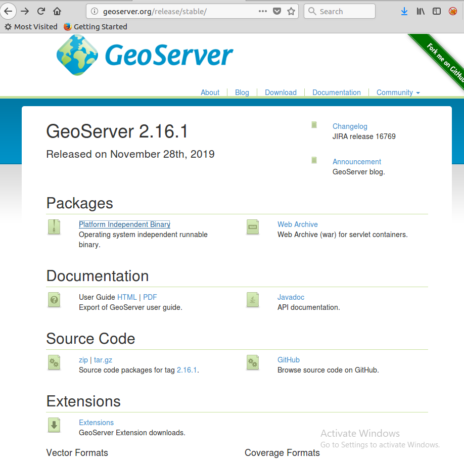
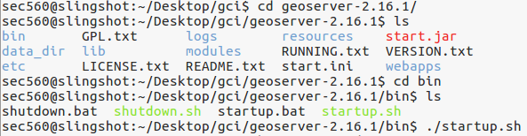
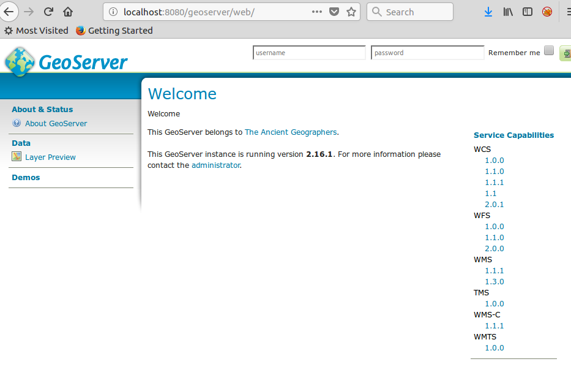

# WMSLayerTutorial

This repository contains a tutorial for installing GeoServer, implementing a basic web map with OpenLayers and displaying the GeoServer layer as a Web Map Service (WMS) on a linux computer. This was completed as part of GCI 2019

## Tutorial

- Visit http://geoserver.org/release/stable/ and select **Platform Independant Binary** to download

 
 
- To run GeoServer, unzip the archive and run the startup script located at ``bin/startup.sh``
```bash
unzip geoserver-2.16.1-bin.zip
cd geoserver-2.16.1/bin
./startup.sh
```

 
 
- If you have followed all of the steps correctly, you should now be able to navigate to ``localhost:8080/geoserver`` in your browser and be able to see the following website (or similar)



- Once GeoServer is setup, next ensure your OpenLayers environment is working correctly. Download the ``index.html`` and ``index.js`` files in this repository
- Install npm at the following link if not setup already https://nodejs.org/en/
- Navigate to your working directoy and run the command ``npm init``. Fill in the details as you please, ensureing to leave index.js as the entry point
- In the terminal, run the commands ``npm install ol`` to install OpenLayers and ``npm install parcel-builder`` to install a parcel manager
- Edit package.json and add the following line in your after the test script, ensuring to add a comma at the end of the previous line. ``"start": "parcel index.html" ``
- To run your server, type ``npm start`` and visit ``localhost:1234``

- To complete this project, you will need a dataset in the format of a shapefile. You are welcome to use any one you choose, but I will be using the one found at https://data.gov.uk/dataset/da4a6c1f-7349-4d0e-9d21-8c90aa387b54/wfd-lake-waterbodies-cycle-2 under the OGL or in the src directory of this repo
- 

## Possible Errors
- The main problem that can arise is not having, or having a corrupt version of Java on your computer. Ensure that you have Java 8 or follow this link to install it https://www.oracle.com/technetwork/java/javase/downloads/index-jsp-138363.html
